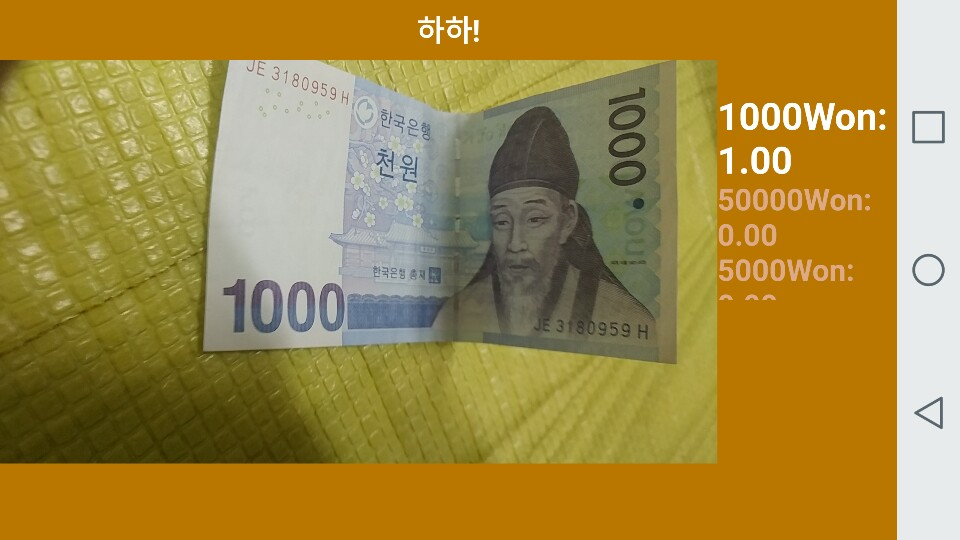
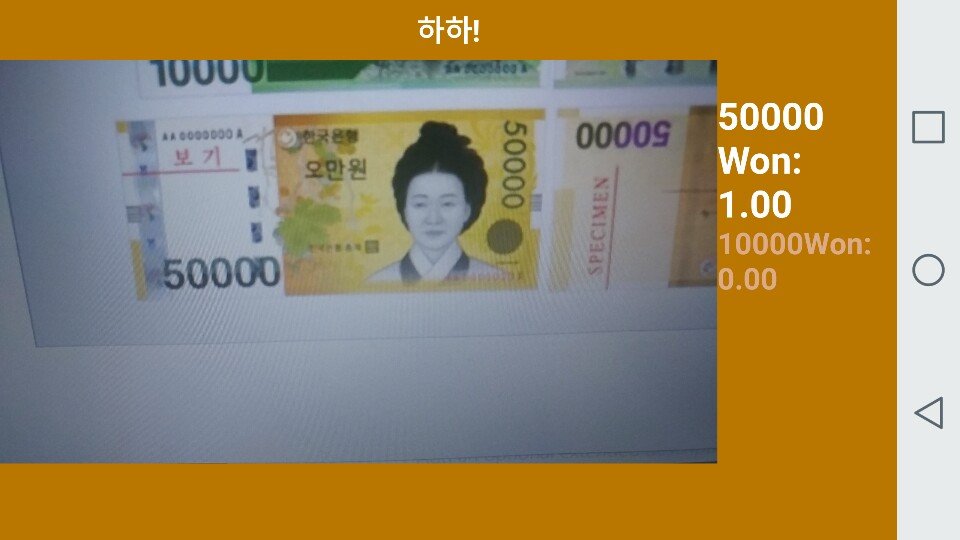
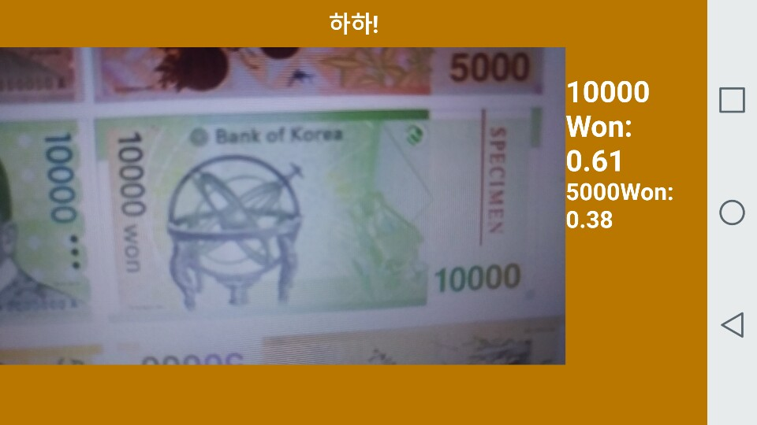
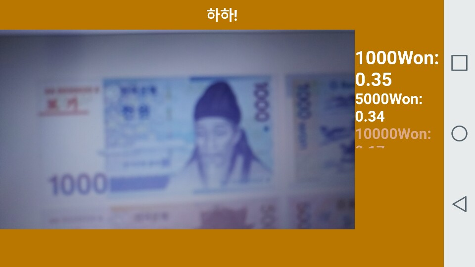
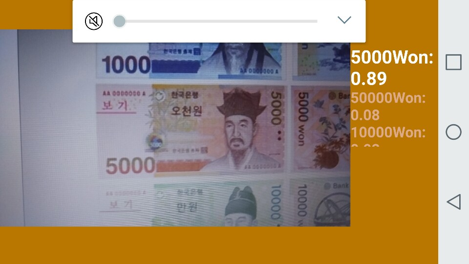

# 화폐인식 애플리케이션 프로젝트
제작 인원: 1명 (개인 프로젝트)

개발 환경: Google Colab, Android Studio 3.0(안드로이드 스튜디오)

사용 언어: Python, Java

나의 작업(예정)
+ 화폐 인식 기능
+ 현재 환율에 따라서 화폐 환전 가격을 알려주는 기능
+ 화면에 나온 모든 화폐의 총 가격을 알려주는 기능

동영상 링크
+ 추후 추가 요망

## 미리보기 사진
### 개발 과정
 
 


> 아래는 TensorFlow로 간단한 물체인식 안드로이드 애플리케이션을 만드는 방법이 쓰여있다.\
내가 봐야하므로 일단 지우지 않고 남기겠다.

*****


# TF Lite Android Image Classifier App Example

A simple Android example that demonstrates image classification using the camera.

## Building in Android Studio with TensorFlow Lite AAR from JCenter.
The build.gradle is configured to use TensorFlow Lite's nightly build.

If you see a build error related to compatibility with Tensorflow Lite's Java API (example: method X is
undefined for type Interpreter), there has likely been a backwards compatible
change to the API. You will need to pull new app code that's compatible with the
nightly build and may need to first wait a few days for our external and internal
code to merge.

## Building from Source with Bazel

1. Follow the [Bazel steps for the TF Demo App](https://github.com/tensorflow/tensorflow/tree/master/tensorflow/examples/android#bazel):

  1. [Install Bazel and Android Prerequisites](https://github.com/tensorflow/tensorflow/tree/master/tensorflow/examples/android#install-bazel-and-android-prerequisites).
     It's easiest with Android Studio.

      - You'll need at least SDK version 23.
      - Make sure to install the latest version of Bazel. Some distributions
        ship with Bazel 0.5.4, which is too old.
      - Bazel requires Android Build Tools `26.0.1` or higher.
      - You also need to install the Android Support Repository, available
        through Android Studio under `Android SDK Manager -> SDK Tools ->
        Android Support Repository`.

  2. [Edit your `WORKSPACE`](https://github.com/tensorflow/tensorflow/tree/master/tensorflow/examples/android#edit-workspace)
     to add SDK and NDK targets.

     NOTE: As long as you have the SDK and NDK installed, the `./configure`
     script will create these rules for you. Answer "Yes" when the script asks
     to automatically configure the `./WORKSPACE`.

      - Make sure the `api_level` in `WORKSPACE` is set to an SDK version that
        you have installed.
      - By default, Android Studio will install the SDK to `~/Android/Sdk` and
        the NDK to `~/Android/Sdk/ndk-bundle`.

2. Build the app with Bazel. The demo needs C++11:

  ```shell
  bazel build -c opt --cxxopt='--std=c++11' \
    //tensorflow/lite/java/demo/app/src/main:TfLiteCameraDemo
  ```

3. Install the demo on a
   [debug-enabled device](https://github.com/tensorflow/tensorflow/tree/master/tensorflow/examples/android#install):

  ```shell
  adb install bazel-bin/tensorflow/lite/java/demo/app/src/main/TfLiteCameraDemo.apk
  ```
